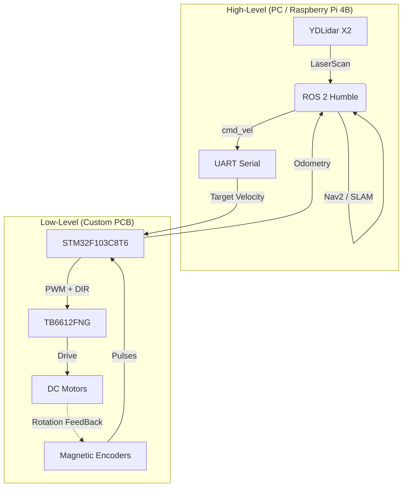

# 🚢 Project Neptune: ROS 2 USV Platform

**Project Neptune** 是一个端到端的低成本无人船（USV）开发平台。它集成了 **ROS 2 Humble** 上位机导航、**STM32** 实时闭环控制以及 **自研集成 PCB**，旨在为教学、科研及工程验证提供一个可高度复现的开源方案。

[快速开始](https://www.google.com/search?q=%23-%E5%BF%AB%E9%80%9F%E9%83%A8%E7%BD%B2) | [硬件文档](https://www.google.com/search?q=%23-%E7%A1%AC%E4%BB%B6%E6%80%BB%E4%BD%93%E8%AF%B4%E6%98%8E) | [系统架构](https://www.google.com/search?q=%23-%E7%B3%BB%E7%BB%9F%E6%9E%B6%E6%9E%84) | [开发路线图](https://www.google.com/search?q=%23-roadmap)

---

## 🏗 系统架构

项目采用分层控制架构，确保了高层导航的灵活性与底层执行的实时性：



---

## 🧠 硬件总体说明

本项目核心控制板已完成 V1.0 版本设计，集成电源管理、电机驱动与核心控制于一体。

### 📂 硬件目录结构

| 文件夹 | 内容说明 |
| --- | --- |
| **[BOM](https://www.google.com/search?q=./hardware/BOM/)** | 物料清单，包含详细的元件规格与立创商城编号 |
| **[Gerber](https://www.google.com/search?q=./hardware/Gerber/)** | 生产制造文件，可直接提交工厂打样 (含钻孔、阻焊、丝印层) |
| **[Project_File](https://www.google.com/search?q=./hardware/Project_File/)** | EDA 工程源文件 (支持嘉立创 EDA 专业版及 Altium Designer 导出格式) |
| **[Schematic](https://www.google.com/search?q=./hardware/Schematic/)** | 原理图 PDF，方便快速查阅电路逻辑 |

### ⚡ 电源与驱动设计

* **输入电压**: 12V DC (支持 3S 锂电池供电)。
* **电源管理**: 板载 MP1584 降压模块，输出 5V 供给核心板、编码器及传感器外设。
* **电机驱动**: TB6612FNG 双 H 桥驱动，支持双路直流减速电机。
* **设计要点**: 动力电源与逻辑电源采用星形布线，并配置多级滤波电容（470uF/100uF）抑制干扰。

### 🛠 STM32 引脚映射

| 功能 | STM32 引脚 | 定时器/外设 | 说明 |
| --- | --- | --- | --- |
| **串口通信** | PA9 (TX) / PA10 (RX) | USART1 | ↔ 树莓派 (交叉连接) |
| **左电机控制** | PA0 (PWM) / PA2, PA3 (DIR) | TIM2_CH1 | 控制电机 A 速度与方向 |
| **右电机控制** | PA1 (PWM) / PA4, PA5 (DIR) | TIM2_CH2 | 控制电机 B 速度与方向 |
| **左编码器** | PA6 (A) / PA7 (B) | TIM3 | 硬件正交解码接口 |
| **右编码器** | PB6 (A) / PB7 (B) | TIM4 | 硬件正交解码接口 |

---

## ⌨️ 快速部署

### 1. 硬件连接 (树莓派 4B ↔ 控制板)

| 树莓派 4B | 控制板接口 | 说明 |
| --- | --- | --- |
| Pin 8 (TXD) | PA10 (RX) | 信号交叉连接 |
| Pin 10 (RXD) | PA9 (TX) | 信号交叉连接 |
| Pin 6 (GND) | GND | **必须共地** |

### 2. 软件构建

```bash
# 进入 ROS 2 工作空间
cd ~/ros2_usv_platform/ros2_ws

# 编译并安装
colcon build --symlink-install
source install/setup.bash

# 启动底层驱动节点
ros2 launch usv_bringup robot.launch.py

```

---

## 📂 目录结构

```text
ros2_usv_platform/
├── firmware/          # STM32 固件源码 (C/C++)
├── ros2_ws/           # ROS 2 工作空间 (Bringup, Interfaces, Description)
├── hardware/          # 硬件设计资源
│   ├── BOM/           # 零件清单
│   ├── Gerber/        # 生产制造文件
│   ├── Project_File/  # EDA 工程源码
│   └── Schematic/     # 原理图 PDF
└── LICENSE            # CC BY-NC-SA 4.0

```

---

## 🛣 Roadmap

* [x] V1.0 集成控制 PCB 设计与打样验证
* [x] 基于硬件定时器的双路正交解码固件实现
* [x] ROS 2 串口协议 (v/w 帧) 通信跑通
* [ ] 增加 EKF (Extended Kalman Filter) 融合 IMU 数据
* [ ] 水面 SLAM 建图及 Nav2 路径规划适配

---

## 📝 许可说明

本项目遵循 **CC BY-NC-SA 4.0** (署名-非商业性使用-相同方式共享) 许可协议。您可以自由地进行学术研究和教学使用，但**禁止未经授权的商业化二次销售**。

