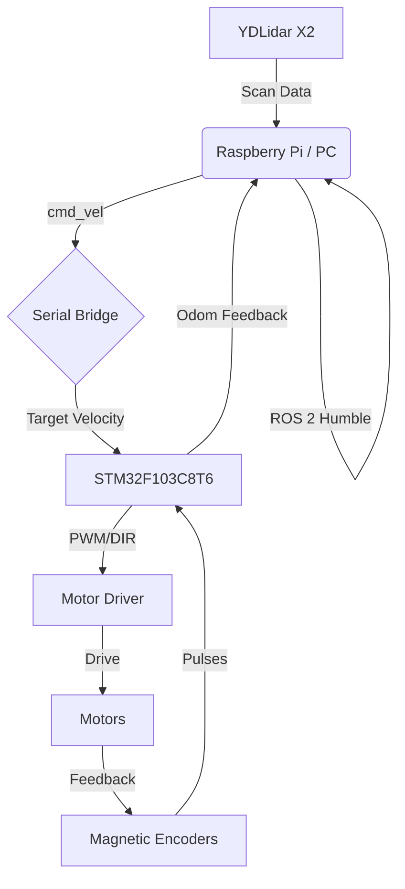

# ROS 2 USV Platform (Project Neptune)

[](https://docs.ros.org/en/humble/index.html)
[](https://www.st.com/en/microcontrollers-microprocessors/stm32f103c8.html)
[](https://creativecommons.org/licenses/by-nc-sa/4.0/)

这是一个端到端的无人船（USV）解决方案，旨在构建一个具备**自主导航、实时避障**能力的低成本水面机器人平台。系统采用 **ROS 2 Humble** 作为分布式计算中枢，**STM32F103C8T6** 作为底层实时运动控制器。

---

## 🚢 项目特性

本平台集成了上位机路径规划与下位机闭环控制，具备以下核心能力：

* **感知层**：支持激光雷达（如 YDLidar X2）进行 SLAM 建图与动态避障。
* **控制层**：STM32 实现双电机差速驱动（Differential Drive），支持磁编码器 PID 闭环。
* **导航层**：深度集成 ROS 2 **Nav2** 导航框架，实现自主路径规划。
* **硬件设计**：模块化设计，包含自定义 PCB 功率分配板与 3D 打印船体组件。

---

## 🏗 系统架构




---

## 🛠 硬件引脚定义 (STM32)

底层控制器负责处理 ROS 2 指令，并实时反馈电机状态。

| 功能模块 | 引脚分配 | 硬件外设 | 备注 |
| --- | --- | --- | --- |
| **ROS2 通信** | PA9 (TX), PA10 (RX) | USART1 | 连接上位机 (115200 bps) |
| **电机 A (左)** | PA0 (PWM), PA2, PA3 (DIR) | TIM2_CH1 | 控制左侧电机速度与方向 |
| **电机 B (右)** | PA1 (PWM), PA4, PA5 (DIR) | TIM2_CH2 | 控制右侧电机速度与方向 |
| **编码器 A (左)** | PA6, PA7 | TIM3 (Encoder Mode) | 捕获左电机磁编码器脉冲 |
| **编码器 B (右)** | PB6, PB7 | TIM4 (Encoder Mode) | 捕获右电机磁编码器脉冲 |

> **安全提示**：请确保上位机（树莓派等）与 STM32 之间 **共地 (GND)**，以防止串行通信异常。

---

## 📂 目录结构

```text
ros2_usv_platform/
├── firmware/
│   └── Slave_Device_Stm32F103C8T6/   # 基于 标准 库的 STM32 固件工程 
├── ros2_ws/                          # ROS 2 工作空间（开发中）
│   └── src/
│       ├── usv_bringup/              # 启动脚本 (Launch) 与全局参数配置
│       ├── usv_hardware/             # 串口通讯节点与硬件接口
│       ├── usv_interfaces/           # 自定义消息 (MSG/SRV)
│       └── usv_description/          # 船体 URDF 模型与 RViz 配置
├── hardware/                         # PCB 原理图与 3D CAD 模型 (即将上线)
└── LICENSE                           # 项目许可协议

```

---

## 🛰 通信协议 (预览)

上位机与下位机采用自定义二进制帧格式进行数据交换：

* **下发 (控制)**: `[Header: 0xAA 0x55 | v_linear | w_angular | Checksum]`
* **上传 (反馈)**: `[Header: 0xAA 0x55 | Left_Vel | Right_Vel | Battery_V | Checksum]`

---

## 🚀 快速开始 (开发中)

### 1. 固件部署

1. 进入 `firmware/` 目录，使用 `Keil uVision5` 打开工程。
2. 编译并使用 ST-Link/J-Link 烧录至 STM32F103C8T6。

### 2. ROS 2 环境配置

```bash
# 克隆仓库
git clone [https://github.com/CNXWZY/ros2_usv_platform.git](https://github.com/CNXWZY/ros2_usv_platform.git)
cd ros2_usv_platform/ros2_ws

# 安装依赖
rosdep install --from-paths src --ignore-src -r -y

# 编译工作空间
colcon build --symlink-install
source install/setup.bash

```

---

## 🛠 开发路线图 (Roadmap)

* [x] STM32 基础动力驱动逻辑 (PWM + Encoder)
* [x] 串口二进制通信协议定义
* [ ] ROS 2 `usv_hardware` 节点开发 (Serial-ROS Bridge)
* [ ] YDLidar X2 驱动接入与 TF 坐标变换
* [ ] 基于 `Slam_toolbox` 的水面环境建图测试
* [ ] Nav2 自主巡航适配与 PID 动态调优

---

## 📝 许可与归属

* **开发者**: [CNXWZY](https://www.google.com/search?q=https://github.com/CNXWZY)
* **状态**: 第一代原型机积极开发中 🏗️
* **许可**: 本项目采用 [CC BY-NC-SA 4.0](https://creativecommons.org/licenses/by-nc-sa/4.0/) 许可协议。


